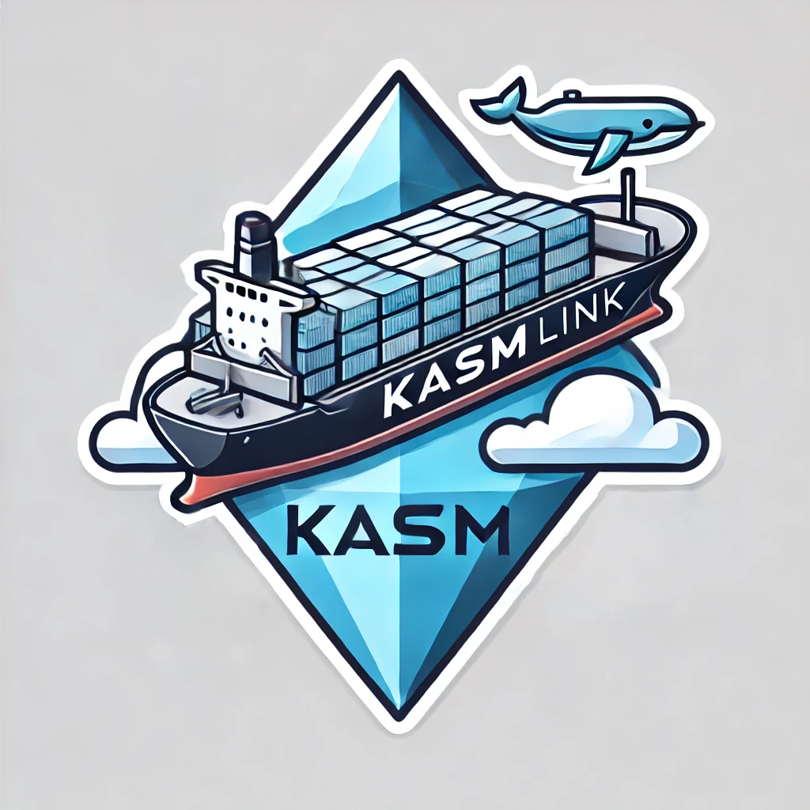

# KasmLink
<div align="center">
  
</div>
KasmLink is a powerful command-line interface (CLI) tool that enables developers to seamlessly deploy GPU-accelerated containers and isolated environments for clients using Docker and Kasm technologies.

## Features

- **User Management**: Easily create, update, delete, and manage users within the Kasm environment.
- **Session Management**: Request, destroy, and monitor sessions with ease.
- **Execute Commands**: Run arbitrary commands inside a Kasm session.
- **SSH Connectivity**: Connect to running Kasm sessions over SSH for direct interaction.
- **Image Management**: List all available Docker images within the Kasm system.

## Requirements

- **Go**: Version 1.20 or later.
- **Docker** and **Kasm**: You need a running Docker environment and a Kasm server to interact with.

## Installation

### Build from Source

To build KasmLink from the source:

1. Clone the repository:
   ```sh
   git clone https://github.com/yourusername/kasmlink.git
   cd kasmlink
   ```

2. Build the binary:
   ```sh
   go build -o kasmlink
   ```

3. (Optional) Add `kasmlink` to your system's `PATH` for easier access:
   ```sh
   mv kasmlink /usr/local/bin/
   ```

### Running KasmLink

You can now use the CLI by running:

```sh
kasmlink --help
```

This command will provide you with a list of all available subcommands and their usage.

## Usage

KasmLink offers a range of commands to interact with your Kasm server. Below are some examples:

### User Management

#### Create a User

```sh
kasmlink create-user -u new_user -p your_password -f "John" -l "Doe"
```

#### Get User Details

```sh
kasmlink get-user -u user_id
```

#### Delete a User

```sh
kasmlink delete-user -u user_id
```

### Session Management

#### Request a Session

```sh
kasmlink request-session -u user_id -i image_id
```

#### Destroy a Session

```sh
kasmlink destroy-session -u user_id -k kasm_id
```

#### SSH Connect to a Session

```sh
kasmlink ssh-connect -u user_id -k kasm_id -s kasm-user -i /path/to/private_key
```

### Image Management

#### List Available Images

```sh
kasmlink list-images
```

### Execute a Command in a Session

```sh
kasmlink exec-command -u user_id -k kasm_id -c "echo Hello, World!"
```

## Command Reference

- `create-user`: Create a new user in the Kasm environment.
- `get-user`: Retrieve details of a specific user.
- `delete-user`: Delete an existing user.
- `request-session`: Request a new Kasm session.
- `destroy-session`: Destroy an active Kasm session.
- `list-images`: List all available Docker images in the Kasm environment.
- `exec-command`: Execute a command inside a Kasm session.
- `ssh-connect`: Initiate an SSH connection to an active Kasm session.

## Configuration

KasmLink interacts with your Kasm server using an API key and secret. You can either:

1. Update the `commands` package code to include your server URL, API key, and secret.
2. Or pass these values dynamically when executing commands:

   ```sh
   kasmlink --api-key your_api_key --api-secret your_api_secret
   ```

## Contributing

Contributions are welcome! Please open an issue or submit a pull request if you have ideas or improvements.

1. Fork the repository.
2. Create a new feature branch (`git checkout -b feature-branch`).
3. Commit your changes (`git commit -am 'Add new feature'`).
4. Push to the branch (`git push origin feature-branch`).
5. Open a pull request.

## Testing

To run the unit tests:

```sh
go test ./...
```

Make sure to include tests when adding new functionality.

## CI/CD Pipeline

This project uses GitHub Actions to run tests and build the application on every push to the `main` branch. Pull requests must pass all tests before being merged.

### Triggering a Release

To create a new version release:

1. Tag your commit with a version number:
   ```sh
   git tag v1.0.0
   git push origin v1.0.0
   ```

   This will trigger a build and release action to package KasmLink binaries for Windows and Linux.

## License

This project is licensed under the MIT License - see the [LICENSE](LICENSE) file for details.

## Author

Developed by [Your Name]. Feel free to reach out if you have questions or feedback!

## Support

For any issues, please open an issue in the [GitHub repository](https://github.com/yourusername/kasmlink/issues).

## Acknowledgements

- **Kasm Technologies** for providing the foundation for containerized desktops.
- **Docker** for containerization support.
